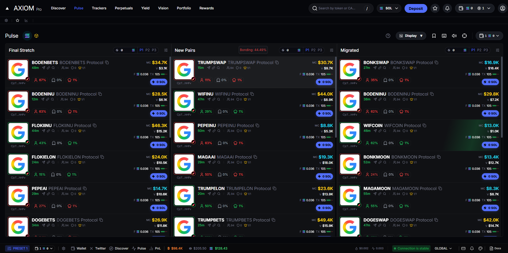
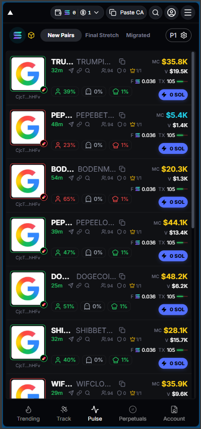

# Axiom Pulse - High-Frequency Token Dashboard

[](https://eterna-axiom-replica.vercel.app/)

A pixel-perfect, real-time cryptocurrency dashboard simulating high-frequency trading updates. Built with **Next.js 14**, **Redux Toolkit**, and **Atomic Design**.

 


## 🚀 Key Features

### ⚡ Performance & Architecture
* **Real-Time Simulation:** Custom `useTokenSocket` hook delivering updates <100ms.
* **State Management:** Redux Toolkit (`pulseSlice`) preventing prop-drilling and managing complex data streams.
* **Render Optimization:** `React.memo` implemented on `TokenCard` to prevent "render avalanches" during high-frequency updates.
* **Atomic Design:** Strict separation of concerns:
    * **Atoms:** `TokenBadge`, `TokenIdentity`, `TabButton`
    * **Molecules:** `TokenCard`, `BondingCard`, `MobileNavbar`
    * **Organisms:** `PulseColumn`

### 🎨 Interaction & Visuals
* **Trend-Aware UI:** "Bonding Curve" popover that detects price direction (Green/Red) in real-time.
* **Micro-Interactions:** Custom CSS `sweep-effect` animations for price updates.
* **Responsive Layout:** Mobile-first Tab Switcher transitioning to a 3-column grid on desktop.
* **Radix UI Primitives:** Accessible Dialogs (Buy Modal) and Hover Cards (Bonding Popover).

## 🛠 Tech Stack

* **Framework:** Next.js 14 (App Router)
* **Styling:** Tailwind CSS + Radix UI
* **State:** Redux Toolkit
* **Icons:** Lucide React
* **Language:** TypeScript

## 🏃‍♂️ Running Locally

1.  **Install dependencies:**
    ```bash
    npm install --legacy-peer-deps
    ```
2.  **Run the development server:**
    ```bash
    npm run dev
    ```
3.  **Open:** [http://localhost:3000](http://localhost:3000)

## 🧠 Design Decisions
* **Why Atomic Design?** To handle the complexity of the `TokenCard`, I decomposed it into atoms (`TokenIdentity`, `TokenBadge`) to ensure reusability and cleaner maintainability.
* **Why Redux?** Given the requirement for "high-frequency updates" across multiple isolated lists, Redux offered a more performant and predictable state container than React Context.